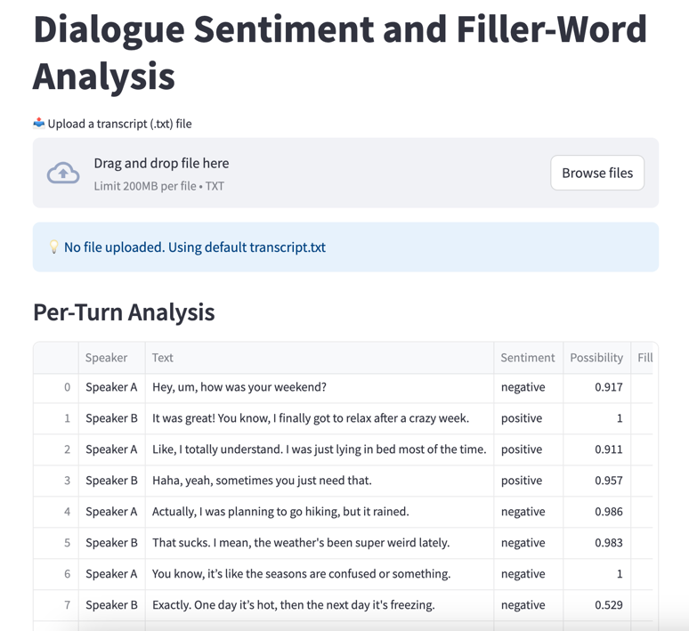
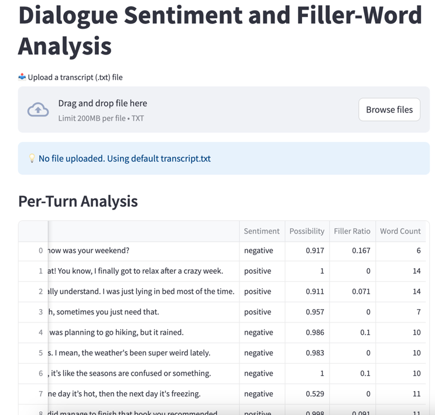

# Dialogue Analysis App

This project is a simple and powerful Python application that analyzes dialogue transcripts for sentiment and filler-word usage. It uses the Hugging Face `transformers` library and `spaCy` for natural language processing, and Streamlit for visualization.

---

## Quick Start

### 1. Clone the repository and install dependencies

```bash
pip install -r requirements.txt
python -m spacy download en_core_web_sm
```

### 2. Run the Streamlit app
```bash
streamlit run app.py
```

### 3. Optional: Upload your own .txt file
You can upload a transcript file in the following format:
```bash
Speaker A: Hello, um, how are you?
Speaker B: I'm good, you know, just tired.
...
```

## Metrics Tracked
The application analyzes each turn of conversation for the following:

- Sentiment: Positive / Negative / Neutral (via Hugging Face sentiment pipeline)
- Filler-Word Ratio: Number of filler words (e.g. um, like, you know) divided by total words
- Sentiment Possibility: Confidence score from the sentiment model
- Word Count: Total number of words per turn

## In one extra hour I would add…
- A download as CSV button to let users export analyzed results
- Support for uploading audio analysis

## Sample Output

